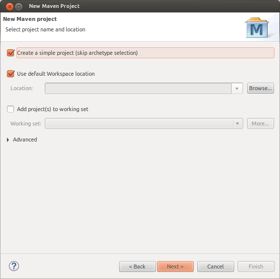
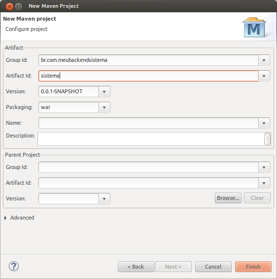

# Roteiro Rápido de Construção do Back-end
O objetivo deste roteiro é iniciar um novo aplicativo utilizando o Framework Demoiselle 3.

No começo será criada a aplicação que irá rodar no servidor, comumente conhecida como back-end.
## Pré Requisitos de Uso
* Eclipse Neon
  * [32 bits](http://www.eclipse.org/downloads/download.php?file=/technology/epp/downloads/release/neon/1/eclipse-jee-neon-1-linux-gtk.tar.gz) / [64 bits](http://www.eclipse.org/downloads/download.php?file=/technology/epp/downloads/release/neon/1/eclipse-jee-neon-1-linux-gtk-x86_64.tar.gz)
* JDK 1.8
  * [Download no site da Oracle](http://www.oracle.com/technetwork/pt/java/javase/downloads/jdk8-downloads-2133151.html)
* WildFly 10.1.0.Final
  * [Download no site do WildFly](http://wildfly.org/downloads/)

## Criação do Projeto REST
Com o Eclipse aberto acesse o menu **File > New > Other**, na janela seguinte filtre por "maven project" como mostra a imagem abaixo:


Clique no botão **Next**, e na próxima tela selecione a opção "Create a simple project (skip archetype selection)" como mostra a imagem abaixo. Esta opção seleciona a criação de um projeto simples sem escolha de arquétipo Maven.



Clique no botão **Next** e na próxima tela digite "br.com.meubackend" no **Group Id** e "sistema" no **Artifact Id**, sem as aspas e por fim escolha "war" no campo **Packaging** como mostra a imagem abaixo.



Clique no botão **Finish**.

### Erro do Web.xml
Neste ponto da criação seu projeto deve estar com o seguinte erro:
```
web.xml is missing and <failOnMissingWebXml> is set to true
```
Para corrigir o problema clique sobre item "Deployment Description: sistema" do projeto e em seguida **Generate Deployment Descriptor Stub**.

### Parent POM - Demoiselle REST
Para carregar todos os módulso padrões para REST e as configurações necessárias para a instalação em um container JEE 7 basta adicionar o seguinte trecho de código em seu `pom.xml`.
```xml
<parent>
    <groupId>org.demoiselle.jee</groupId>
    <artifactId>demoiselle-parent-rest</artifactId>
    <version>3.0.0-BETA1</version>
    <relativePath>../demoiselle-parent-rest</relativePath>
</parent>

```

> Após adicionar é importante atualizar as configurações do Maven clicando sobre o projeto com o botão direito do mouse, acessando as opções do Maven e por fim clicando em **Update Project**. Na tela que será aberta selecione o seu projeto e clique em **OK**.

O resultado da criação deve ser algo parecido com a imagem abaixo.


## Criação das Entidades e Persistência
Texto.
## Criação dos Serviços REST
Texto.
## Testando o Back-end da Aplicação
SWAGGER!!!