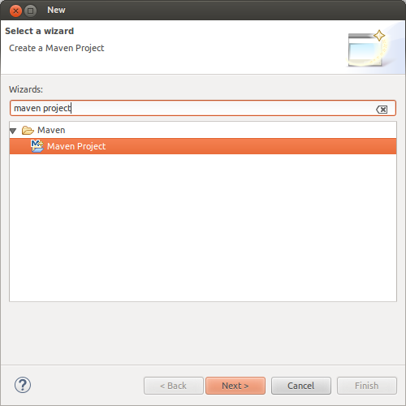

# Roteiro Rápido de Construção do Back-end
O objetivo deste roteiro é iniciar um novo aplicativo utilizando o Framework Demoiselle 3.

No começo será criada a aplicação que irá rodar no servidor, comumente conhecida como back-end.
## Pré Requisitos de Uso
* Eclipse Neon
  * [32 bits](http://www.eclipse.org/downloads/download.php?file=/technology/epp/downloads/release/neon/1/eclipse-jee-neon-1-linux-gtk.tar.gz) / [64 bits](http://www.eclipse.org/downloads/download.php?file=/technology/epp/downloads/release/neon/1/eclipse-jee-neon-1-linux-gtk-x86_64.tar.gz)
* JDK 1.8
  * [Download no site da Oracle](http://www.oracle.com/technetwork/pt/java/javase/downloads/jdk8-downloads-2133151.html)
* WildFly 10.1.0.Final
  * [Download no site do WildFly](http://wildfly.org/downloads/)

## Criação do Projeto REST
Com o Eclipse aberto acesse o menu File > New > Other, na janela seguinte filtre por "maven project" como mostra a imagem abaixo:

Clique em Next, e na próxima tela selecione a opção "Create a simple project (skip archetype selection)" como mostra a imagem abaixo. Esta opção seleciona a criação de um projeto simples sem escolha de arquétipo Maven.

## Módulos Demoiselle

## Testando o Backend da Aplicação
Texto.